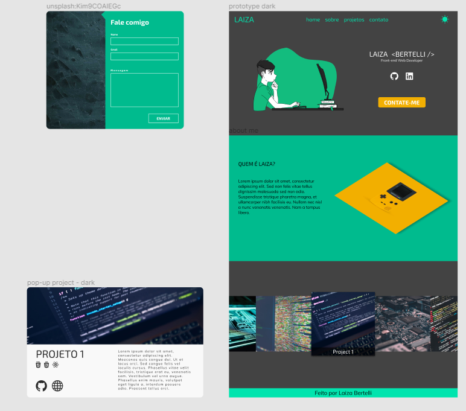

# Portfolio

Portfolio pessoal para exibir os projetos que realizei ao longo dos meus estudos como Desenvolvedora Front-end.

# Como usar

Para ter o projeto funcionando em sua máquina:
  01. Clone o repositório

          git clone git@github.com:LaizaBertelli/portfolio.git

  01. Acesse o diretório

          cd portfolio
  01. Instale as dependências.

          npm install
  01. Rode o projeto

          npm start

# Techs

Esse projeto está sendo desenvolvido em React e estilizado com CSS.

# Design

A ideia é implementar o dark mode primeiro para ter um site funcional e só depois implementar o light mode.

Você pode acessar o protótipo figma [aqui](https://www.figma.com/file/BgRhAVemWt7gzHOvTC5V5E/portfolio?node-id=0%3A1).

